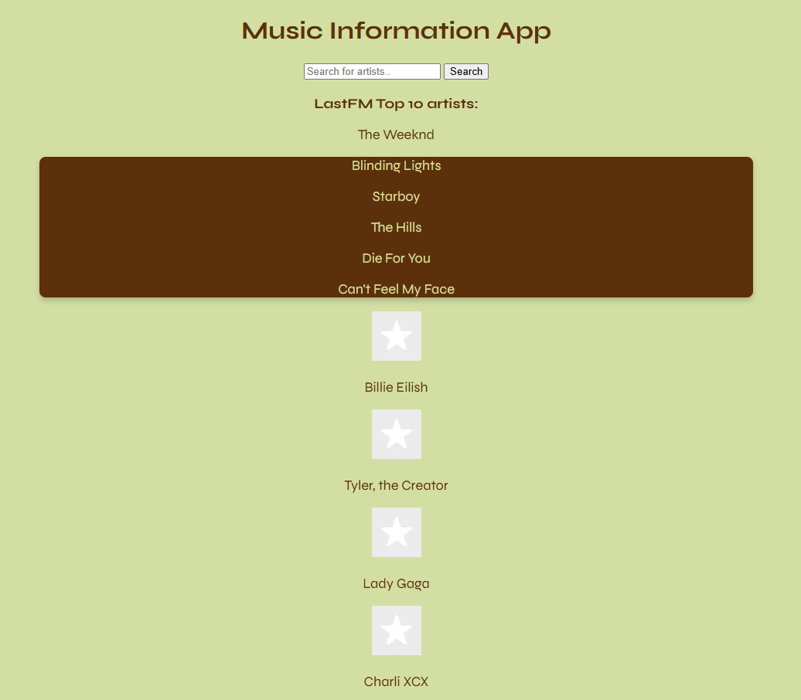

# Music Information App

Created by Mikael Lönnberg

## Demo link:

Access my site at https://musicinformationapp.netlify.app/

## How was the workload divided

Workload was done solely by Mikael Lönnberg.

## Table of Content:

- [About The App](#about-the-app)
- [Screenshots](#screenshots)
- [Technologies](#technologies)
- [Setup](#setup)
- [Approach](#approach)
- [Status](#status)
- [Credits](#credits)
- [License](#license)

## About The App

Music Information App is an app that shows information using LastFM:s API. First when you load the page, you will see current top 10 artists, once you click the artist's name, it will show you their top 5 songs. You can make custom searches to artists as well. Same thing applies there when you click on the artist's name. You are able to hide the top 5 songs by clicking the artist's name again.

## Screenshots

Picture by [Mikael Lönnberg](https://www.linkedin.com/in/mikael-l%C3%B6nnberg-75806a194/)

## Technologies

I used the following technologies `html`, `css` and `JavaScript` for the whole project. `html`was used for the basic layout of the app. `css`was used to style the app. `JavaScript` was used for everything else. Making multiple functions to fetch and display information from LastFM:s API.

## Setup

- download all the files and open index.html in your browser
- download or clone the repository
- open index.html in browser
OR
- open the app straight from the link provided at the top.

- Click the artist's name to reveal their top 5 songs, click the name again to hide the songs.
- Search for another artist in the search bar.
- Click the artist's name to reveal their top 5 songs, click the name again to hide the songs.

## Status

Music Information App is done for now. `Version 2` might me out at some point.

## Credits

-[AI](https://chatgpt.com/) used for most parts, where help was needed. I was using fetch instead of httprequest, which was new to me, so AI helped me along the way. For styling I used [w3schools](https://www.w3schools.com/) and [stackoverflow](https://stackoverflow.com/).

## License

MIT license @ [Mikael Lönnberg](https://www.linkedin.com/in/mikael-l%C3%B6nnberg-75806a194/)